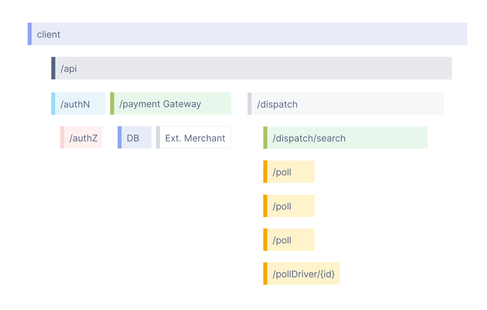
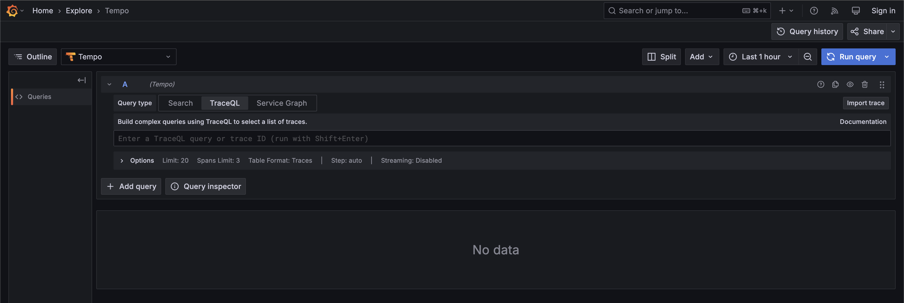
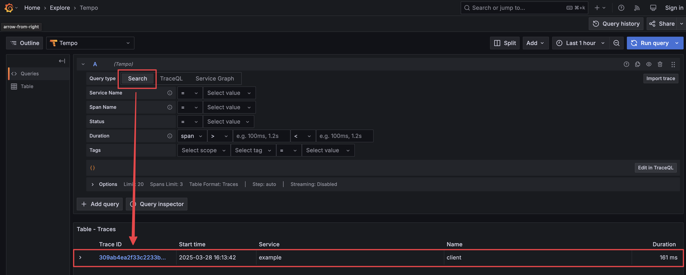
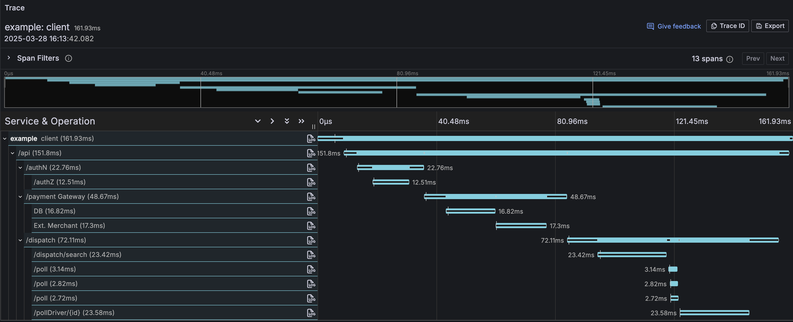

尽管日志和指标有助于理解单个服务的行为，但它们不足以完整呈现分布式系统中一个请求的生命周期。

在分布式系统中，一个请求可能跨越多个服务，而每个服务为了完成该请求也可能向其他服务发起多次请求。在这种情况下，我们需要一种方法来追踪请求在多个服务之间的生命周期，从而诊断哪些服务是瓶颈，以及请求把大部分时间花在了哪里。

## Span

**span** 表示一个请求中的单个工作单元或操作。它详细呈现了该特定操作执行期间发生了什么。

每个 span 通常包含以下信息：

| Span 组件        | 说明                                                              |
| ---------------- | ------------------------------------------------------------------ |
| **Name**         | 描述正在追踪的具体操作。                                          |
| **Timing Data**  | 指示操作开始时间的时间戳及其持续时间。                            |
| **Log Messages** | 捕获操作期间重要事件的结构化日志。                                |
| **Attributes**   | 提供该操作附加上下文的元数据。                                    |

span 是追踪中的关键构建块，帮助你可视化和理解请求在各种服务之间的流转。

## Trace

Trace 记录请求（由应用程序或最终用户发起）在微服务、无服务器应用等多服务架构中传播时所经过的路径。

如果没有追踪，就很难在分布式系统中定位性能问题的根因。

Trace 由一个或多个 span 组成。第一个 span 表示根 span。每个根 span 都表示一个从开始到结束的完整请求。父 span 之下的各个 span 提供了更深入的上下文，说明请求期间发生了什么（或者说一个请求由哪些步骤构成）。

许多可观测性后端会把 trace 可视化为瀑布图，大致如下所示：



瀑布图展示了根 span 与其子 span 之间的父子关系。当一个 span 包裹另一个 span 时，这也表示一种嵌套关系。

## 创建 Span

你可以使用 `Effect.withSpan` API 创建一个 span，从而为 effect 添加追踪能力。这有助于你追踪 effect 中的特定操作。

**示例**（为 Effect 添加 Span）

```ts
import { Effect } from "effect"

// Define an effect that delays for 100 milliseconds
const program = Effect.void.pipe(Effect.delay("100 millis"))

// Instrument the effect with a span for tracing
const instrumented = program.pipe(Effect.withSpan("myspan"))

Effect.isEffect(instrumented) // => true
await Effect.runPromise(instrumented) // => undefined
```

用 span 对 effect 进行插桩不会改变其类型。如果你传入的是 `Effect<A, E, R>`，结果仍然是 `Effect<A, E, R>`。

## 打印 Span

为了调试或分析而打印 span，你需要安装所需的追踪工具。以下是为你的项目配置它们的方法。

### 安装依赖

选择你的包管理器并安装所需的库：

   <Tabs syncKey="package-manager">

   <TabItem label="npm" icon="seti:npm">

```sh
# Install the main library for integrating OpenTelemetry with Effect
npm install @effect/opentelemetry@rc

# Install the required OpenTelemetry SDKs for tracing and metrics
npm install @opentelemetry/sdk-trace-base
npm install @opentelemetry/sdk-trace-node
npm install @opentelemetry/sdk-trace-web
npm install @opentelemetry/sdk-metrics
```

   </TabItem>

   <TabItem label="pnpm" icon="pnpm">

```sh
# Install the main library for integrating OpenTelemetry with Effect
pnpm add @effect/opentelemetry@rc

# Install the required OpenTelemetry SDKs for tracing and metrics
pnpm add @opentelemetry/sdk-trace-base
pnpm add @opentelemetry/sdk-trace-node
pnpm add @opentelemetry/sdk-trace-web
pnpm add @opentelemetry/sdk-metrics
```

   </TabItem>

   <TabItem label="Yarn" icon="seti:yarn">

```sh
# Install the main library for integrating OpenTelemetry with Effect
yarn add @effect/opentelemetry@rc

# Install the required OpenTelemetry SDKs for tracing and metrics
yarn add @opentelemetry/sdk-trace-base
yarn add @opentelemetry/sdk-trace-node
yarn add @opentelemetry/sdk-trace-web
yarn add @opentelemetry/sdk-metrics
```

   </TabItem>

   <TabItem label="Bun" icon="bun">

```sh
# Install the main library for integrating OpenTelemetry with Effect
bun add @effect/opentelemetry@rc

# Install the required OpenTelemetry SDKs for tracing and metrics
bun add @opentelemetry/sdk-trace-base
bun add @opentelemetry/sdk-trace-node
bun add @opentelemetry/sdk-trace-web
bun add @opentelemetry/sdk-metrics
```

   </TabItem>

   </Tabs>

<Aside type="note" title="Peer Dependency">
  `@opentelemetry/api` 包是 `@effect/opentelemetry` 的 peer dependency。如果你的包管理器不会自动
  安装 peer dependency，你必须手动添加它。
</Aside>

### 将 Span 打印到控制台

依赖安装完成后，就可以使用 OpenTelemetry 配置 span 打印。下面的示例展示了如何为 effect 打印 span。

**示例**（设置并打印 Span）

```ts
import { Effect } from "effect"
import { NodeSdk } from "@effect/opentelemetry"
import {
  ConsoleSpanExporter,
  BatchSpanProcessor,
} from "@opentelemetry/sdk-trace-base"

// Define an effect that delays for 100 milliseconds
const program = Effect.void.pipe(Effect.delay("100 millis"))

// Instrument the effect with a span for tracing
const instrumented = program.pipe(Effect.withSpan("myspan"))

// Set up tracing with the OpenTelemetry SDK
const NodeSdkLive = NodeSdk.layer(() => ({
  resource: { serviceName: "example" },
  // Export span data to the console
  spanProcessor: new BatchSpanProcessor(new ConsoleSpanExporter()),
}))

// Run the effect, providing the tracing layer
Effect.runPromise(instrumented.pipe(Effect.provide(NodeSdkLive)))
/*
Example Output:
{
  resource: {
    attributes: {
      'service.name': 'example',
      'telemetry.sdk.language': 'nodejs',
      'telemetry.sdk.name': '@effect/opentelemetry',
      'telemetry.sdk.version': '1.28.0'
    }
  },
  instrumentationScope: { name: 'example', version: undefined, schemaUrl: undefined },
  traceId: '673c06608bd815f7a75bf897ef87e186',
  parentId: undefined,
  traceState: undefined,
  name: 'myspan',
  id: '401b2846170cd17b',
  kind: 0,
  timestamp: 1733220735529855.5,
  duration: 102079.958,
  attributes: {},
  status: { code: 1 },
  events: [],
  links: []
}
*/
```

### 理解 Span 输出

输出中提供了关于该 span 的详细信息：

| 字段         | 说明                                                                                                                                                                                                          |
| ------------ | -------------------------------------------------------------------------------------------------------------------------------------------------------------------------------------------------------------- |
| `traceId`    | 整个 trace 的唯一标识符，帮助在请求或操作流经应用时对其进行追踪。                                                                                                                                              |
| `parentId`   | 标识当前 span 的父 span；当没有父 span 时，输出中会标记为 `undefined`，从而说明它是一个根 span。                                                                                                              |
| `name`       | 描述 span 的名称，指示正在追踪的操作（例如 “myspan”）。                                                                                                                                                        |
| `id`         | 当前 span 的唯一标识符，用于将其与同一 trace 中的其他 span 区分开。                                                                                                                                            |
| `timestamp`  | 表示 span 开始时间的时间戳，以自 Unix 纪元以来的微秒数计量。                                                                                                                                                   |
| `duration`   | 指定 span 的持续时间，表示完成该操作所花费的时间（例如 `2895.769` 微秒）。                                                                                                                                     |
| `attributes` | span 可以包含 attributes，它们是提供操作附加上下文或信息的键值对。在此输出中，它是一个空对象，表示这个 span 没有任何特定的 attributes。                                                                       |
| `status`     | status 字段提供 span 状态的信息。在此例中，它的 code 为 1，通常表示 OK 状态（而 code 为 2 表示 ERROR 状态）。                                                                                                   |
| `events`     | span 可以包含 events，它们是 span 生命周期中特定时刻的记录。在此输出中，它是一个空数组，表示没有记录任何特定事件。                                                                                            |
| `links`      | links 可用于将这个 span 与其他 trace 中的 span 关联起来。在输出中，它是一个空数组，表示这个 span 没有特定的 links。                                                                                            |

### Span 捕获错误

下面是 effect 遇到错误时 span 呈现的样子：

**示例**（失败 Effect 的 Span）

```ts
import { Effect } from "effect"
import { NodeSdk } from "@effect/opentelemetry"
import {
  ConsoleSpanExporter,
  BatchSpanProcessor,
} from "@opentelemetry/sdk-trace-base"

const program = Effect.fail("Oh no!").pipe(
  Effect.delay("100 millis"),
  Effect.withSpan("myspan"),
)

const NodeSdkLive = NodeSdk.layer(() => ({
  resource: { serviceName: "example" },
  spanProcessor: new BatchSpanProcessor(new ConsoleSpanExporter()),
}))

Effect.runPromiseExit(program.pipe(Effect.provide(NodeSdkLive))).then(
  console.log,
)
/*
Example Output:
{
  resource: {
    attributes: {
      'service.name': 'example',
      'telemetry.sdk.language': 'nodejs',
      'telemetry.sdk.name': '@effect/opentelemetry',
      'telemetry.sdk.version': '1.28.0'
    }
  },
  instrumentationScope: { name: 'example', version: undefined, schemaUrl: undefined },
  traceId: 'eee9619866179f209b7aae277283e71f',
  parentId: undefined,
  traceState: undefined,
  name: 'myspan',
  id: '3a5725c91884c9e1',
  kind: 0,
  timestamp: 1733220830575626,
  duration: 106578.042,
  attributes: {
    'code.stacktrace': 'at <anonymous> (/Users/giuliocanti/Documents/GitHub/website/content/dev/index.ts:10:10)'
  },
  status: { code: 2, message: 'Oh no!' },
  events: [
    {
      name: 'exception',
      attributes: {
        'exception.type': 'Error',
        'exception.message': 'Oh no!',
        'exception.stacktrace': 'Error: Oh no!'
      },
      time: [ 1733220830, 682204083 ],
      droppedAttributesCount: 0
    }
  ],
  links: []
}
{
  _id: 'Exit',
  _tag: 'Failure',
  cause: { _id: 'Cause', _tag: 'Fail', failure: 'Oh no!' }
}
*/
```

在这个示例中，span 的 status code 为 `2`，表示发生了错误。status 中的 message 提供了关于该失败的更多细节。

## 添加注解

你可以使用 `Effect.annotateCurrentSpan` 函数为 span 提供额外信息。
该函数允许你附加键值对，为 span 的执行提供更多上下文。

**示例**（为 Span 添加注解）

```ts
import { Effect } from "effect"
import { NodeSdk } from "@effect/opentelemetry"
import {
  ConsoleSpanExporter,
  BatchSpanProcessor,
} from "@opentelemetry/sdk-trace-base"

const program = Effect.void.pipe(
  Effect.delay("100 millis"),
  // Annotate the span with a key-value pair
  Effect.tap(() => Effect.annotateCurrentSpan("key", "value")),
  // Wrap the effect in a span named 'myspan'
  Effect.withSpan("myspan"),
)

// Set up tracing with the OpenTelemetry SDK
const NodeSdkLive = NodeSdk.layer(() => ({
  resource: { serviceName: "example" },
  spanProcessor: new BatchSpanProcessor(new ConsoleSpanExporter()),
}))

// Run the effect, providing the tracing layer
Effect.runPromise(program.pipe(Effect.provide(NodeSdkLive)))
/*
Example Output:
{
  resource: {
    attributes: {
      'service.name': 'example',
      'telemetry.sdk.language': 'nodejs',
      'telemetry.sdk.name': '@effect/opentelemetry',
      'telemetry.sdk.version': '1.28.0'
    }
  },
  instrumentationScope: { name: 'example', version: undefined, schemaUrl: undefined },
  traceId: 'c8120e01c0f1ea83ccc1d388e5cdebd3',
  parentId: undefined,
  traceState: undefined,
  name: 'myspan',
  id: '81c430ba4979f1db',
  kind: 0,
  timestamp: 1733220874356084,
  duration: 102821.417,
  attributes: { key: 'value' },
  status: { code: 1 },
  events: [],
  links: []
}
*/
```

## 日志即事件

在追踪的语境中，日志会被转换为 “Span Events”。这些事件以结构化方式揭示应用的活动，并提供特定操作发生时间的时间线。

```ts
import { Effect } from "effect"
import { NodeSdk } from "@effect/opentelemetry"
import {
  ConsoleSpanExporter,
  BatchSpanProcessor,
} from "@opentelemetry/sdk-trace-base"

// Define a program that logs a message and delays for 100 milliseconds
const program = Effect.log("Hello").pipe(
  Effect.delay("100 millis"),
  Effect.withSpan("myspan"),
)

// Set up tracing with the OpenTelemetry SDK
const NodeSdkLive = NodeSdk.layer(() => ({
  resource: { serviceName: "example" },
  spanProcessor: new BatchSpanProcessor(new ConsoleSpanExporter()),
}))

// Run the effect, providing the tracing layer
Effect.runPromise(program.pipe(Effect.provide(NodeSdkLive)))
/*
Example Output:
{
  resource: {
    attributes: {
      'service.name': 'example',
      'telemetry.sdk.language': 'nodejs',
      'telemetry.sdk.name': '@effect/opentelemetry',
      'telemetry.sdk.version': '1.28.0'
    }
  },
  instrumentationScope: { name: 'example', version: undefined, schemaUrl: undefined },
  traceId: 'b0f4f012b5b13c0a040f7002a1d7b020',
  parentId: undefined,
  traceState: undefined,
  name: 'myspan',
  id: 'b9ba8472002715a8',
  kind: 0,
  timestamp: 1733220905504162.2,
  duration: 103790,
  attributes: {},
  status: { code: 1 },
  events: [
    {
      name: 'Hello',
      attributes: { 'effect.fiberId': '#0', 'effect.logLevel': 'INFO' }, // Log attributes
      time: [ 1733220905, 607761042 ], // Event timestamp
      droppedAttributesCount: 0
    }
  ],
  links: []
}
*/
```

每个 span 都可以包含 events，它们捕获 span 执行过程中的特定时刻。在这个示例中，一条日志消息 `"Hello"` 被记录为该 span 内的一个事件。该事件的关键细节包括：

| 字段                     | 说明                                                                                              |
| ------------------------ | ------------------------------------------------------------------------------------------------- |
| `name`                   | 事件的名称，与所记录的日志消息对应（例如 `'Hello'`）。                                            |
| `attributes`             | 提供事件附加上下文的键值对，例如 `fiberId` 和日志级别。                                           |
| `time`                   | 事件发生的时间戳，以高精度格式显示。                                                              |
| `droppedAttributesCount` | 表示有多少 attributes 被丢弃（如果有的话）。在此例中，没有 attributes 被丢弃。                   |

## 嵌套 Span

span 可以嵌套，以表示操作的层次结构。这让你能够追踪应用的不同部分在执行期间如何相互关联。下面的示例演示了如何创建和管理嵌套 span。

**示例**（在 Trace 中嵌套 Span）

```ts
import { Effect } from "effect"
import { NodeSdk } from "@effect/opentelemetry"
import {
  ConsoleSpanExporter,
  BatchSpanProcessor,
} from "@opentelemetry/sdk-trace-base"

const child = Effect.void.pipe(
  Effect.delay("100 millis"),
  Effect.withSpan("child"),
)

const parent = Effect.gen(function* () {
  yield* Effect.sleep("20 millis")
  yield* child
  yield* Effect.sleep("10 millis")
}).pipe(Effect.withSpan("parent"))

// Set up tracing with the OpenTelemetry SDK
const NodeSdkLive = NodeSdk.layer(() => ({
  resource: { serviceName: "example" },
  spanProcessor: new BatchSpanProcessor(new ConsoleSpanExporter()),
}))

// Run the effect, providing the tracing layer
Effect.runPromise(parent.pipe(Effect.provide(NodeSdkLive)))
/*
Example Output:
{
  resource: {
    attributes: {
      'service.name': 'example',
      'telemetry.sdk.language': 'nodejs',
      'telemetry.sdk.name': '@effect/opentelemetry',
      'telemetry.sdk.version': '1.28.0'
    }
  },
  instrumentationScope: { name: 'example', version: undefined, schemaUrl: undefined },
  traceId: 'a9cd69ad70698a0c7b7b774597c77d39',
  parentId: 'a09e5c3fdfdbbc1d', // This indicates the span is a child of 'parent'
  traceState: undefined,
  name: 'child',
  id: '210d2f9b648389a4', // Unique ID for the child span
  kind: 0,
  timestamp: 1733220970590126.2,
  duration: 101579.875,
  attributes: {},
  status: { code: 1 },
  events: [],
  links: []
}
{
  resource: {
    attributes: {
      'service.name': 'example',
      'telemetry.sdk.language': 'nodejs',
      'telemetry.sdk.name': '@effect/opentelemetry',
      'telemetry.sdk.version': '1.28.0'
    }
  },
  instrumentationScope: { name: 'example', version: undefined, schemaUrl: undefined },
  traceId: 'a9cd69ad70698a0c7b7b774597c77d39',
  parentId: undefined, // Indicates this is the root span
  traceState: undefined,
  name: 'parent',
  id: 'a09e5c3fdfdbbc1d', // Unique ID for the parent span
  kind: 0,
  timestamp: 1733220970569015.2,
  duration: 132612.208,
  attributes: {},
  status: { code: 1 },
  events: [],
  links: []
}
*/
```

父子关系在 span 输出中清晰可见：`child` span 的 `parentId` 与 `parent` span 的 `id` 相匹配。这种结构有助于追踪单个 trace 内各操作之间的关联关系。

## 教程：可视化 Trace

在本教程中，我们将带你一步步可视化一个示例 Effect 应用生成的 Trace。这个示例应用还被配置为通过 HTTP 以 [OTLP 格式](https://github.com/open-telemetry/opentelemetry-proto/blob/main/docs/specification.md)导出 Trace 和/或指标。

为了可视化应用导出的 Trace，我们将使用一个 Docker 镜像，其中包含一套预配置的 OpenTelemetry 后端，它基于 [OpenTelemetry Collector](https://opentelemetry.io/docs/collector)、[Prometheus](https://github.com/prometheus/prometheus)、[Loki](https://github.com/grafana/loki)、[Tempo](https://github.com/grafana/tempo) 和 [Grafana](https://github.com/grafana/grafana)。

### 工具说明

让我们用通俗的语言来理解将要使用的这些工具：

- **Docker**：Docker 让我们可以在容器中运行应用。可以把容器看作一个轻量且隔离的环境，无论宿主机系统是什么，你的应用都能在其中一致地运行。它有点像虚拟机，但更高效。

- **Prometheus**：Prometheus 是一个监控与告警工具包。它会收集应用的指标与数据并存储起来，以便进一步分析。这有助于发现性能问题、理解应用的行为。

- **Loki**：Loki 是一个受 Prometheus 启发的日志聚合系统。它不会为日志内容建立索引，而是为每个日志流的一组标签建立索引。

- **Grafana**：Grafana 是一个可视化与分析平台。它有助于创建美观且可交互的仪表盘，用来可视化应用的数据。你可以用它以图形方式展示 Prometheus 收集的指标。

- **Tempo**：Tempo 是一个分布式追踪系统，让你能够追踪一个请求在应用中流转的全过程。它提供关于请求如何被处理的洞察，并帮助你调试和优化应用。

### 获取 Docker

要获取 Docker，请按以下步骤操作：

1. 访问 Docker 网站 [https://www.docker.com/](https://www.docker.com/)。

2. 下载适用于你的操作系统（Windows 或 macOS）的 Docker Desktop 并安装。

3. 安装完成后，打开 Docker Desktop，它会在后台运行。

### 模拟 Trace

<Steps>

1. **启动 OpenTelemetry 后端**

   在开始从示例应用生成并导出 Trace 之前，我们需要先在 Docker 中把 OpenTelemetry 后端运行起来。

   可以用下面的命令完成：

   ```sh
   docker run -p 3000:3000 -p 4317:4317 -p 4318:4318 --rm -it docker.io/grafana/otel-lgtm
   ```

2. **安装依赖**

   我们还需要安装一些额外的依赖，以及最新版本的 `effect`：

   <Tabs syncKey="package-manager">

   <TabItem label="npm" icon="seti:npm">

   ```sh
   # If not already installed
   npm install effect@rc
   # Required to integrate Effect with OpenTelemetry
   npm install @effect/opentelemetry@rc
   # Required to export traces over HTTP in OTLP format
   npm install @opentelemetry/exporter-trace-otlp-http
   # Required by all applications
   npm install @opentelemetry/sdk-trace-base
   # For NodeJS applications
   npm install @opentelemetry/sdk-trace-node
   # For browser applications
   npm install @opentelemetry/sdk-trace-web
   # If you also need to export metrics
   npm install @opentelemetry/sdk-metrics
   ```

   </TabItem>

   <TabItem label="pnpm" icon="pnpm">

   ```sh
   # If not already installed
   pnpm add effect@rc
   # Required to integrate Effect with OpenTelemetry
   pnpm add @effect/opentelemetry@rc
   # Required to export traces over HTTP in OTLP format
   pnpm add @opentelemetry/exporter-trace-otlp-http
   # Required by all applications
   pnpm add @opentelemetry/sdk-trace-base
   # For NodeJS applications
   pnpm add @opentelemetry/sdk-trace-node
   # For browser applications
   pnpm add @opentelemetry/sdk-trace-web
   # If you also need to export metrics
   pnpm add @opentelemetry/sdk-metrics
   ```

   </TabItem>

   <TabItem label="Yarn" icon="seti:yarn">

   ```sh
   # If not already installed
   yarn add effect@rc
   # Required to integrate Effect with OpenTelemetry
   yarn add @effect/opentelemetry@rc
   # Required to export traces over HTTP in OTLP format
   yarn add @opentelemetry/exporter-trace-otlp-http
   # Required by all applications
   yarn add @opentelemetry/sdk-trace-base
   # For NodeJS applications
   yarn add @opentelemetry/sdk-trace-node
   # For browser applications
   yarn add @opentelemetry/sdk-trace-web
   # If you also need to export metrics
   yarn add @opentelemetry/sdk-metrics
   ```

   </TabItem>

   <TabItem label="Bun" icon="bun">

   ```sh
   # If not already installed
   bun add effect@rc
   # Required to integrate Effect with OpenTelemetry
   bun add @effect/opentelemetry@rc
   # Required to export traces over HTTP in OTLP format
   bun add @opentelemetry/exporter-trace-otlp-http
   # Required by all applications
   bun add @opentelemetry/sdk-trace-base
   # For NodeJS applications
   bun add @opentelemetry/sdk-trace-node
   # For browser applications
   bun add @opentelemetry/sdk-trace-web
   # If you also need to export metrics
   bun add @opentelemetry/sdk-metrics
   ```

   </TabItem>

   </Tabs>

3. **模拟 Trace**

   现在，让我们用一个示例 Node.js 应用来模拟 Trace。

   下面的代码模拟了一组任务，并为每个任务生成 Trace。它还设置了一个 `Layer`，用于通过 HTTP 以 OTLP 格式把应用中的 Trace 导出到我们的 OpenTelemetry 后端。

   ```ts
   import { Effect } from "effect"
   import { NodeSdk } from "@effect/opentelemetry"
   import { BatchSpanProcessor } from "@opentelemetry/sdk-trace-base"
   import { OTLPTraceExporter } from "@opentelemetry/exporter-trace-otlp-http"

   // Function to simulate a task with possible subtasks
   const task = (
     name: string,
     delay: number,
     children: ReadonlyArray<Effect.Effect<void>> = [],
   ) =>
     Effect.gen(function* () {
       yield* Effect.log(name)
       yield* Effect.sleep(`${delay} millis`)
       for (const child of children) {
         yield* child
       }
       yield* Effect.sleep(`${delay} millis`)
     }).pipe(Effect.withSpan(name))

   const poll = task("/poll", 1)

   // Create a program with tasks and subtasks
   const program = task("client", 2, [
     task("/api", 3, [
       task("/authN", 4, [task("/authZ", 5)]),
       task("/payment Gateway", 6, [task("DB", 7), task("Ext. Merchant", 8)]),
       task("/dispatch", 9, [
         task("/dispatch/search", 10),
         Effect.all([poll, poll, poll]),
         task("/pollDriver/{id}", 11),
       ]),
     ]),
   ])

   const NodeSdkLive = NodeSdk.layer(() => ({
     resource: { serviceName: "example" },
     spanProcessor: new BatchSpanProcessor(new OTLPTraceExporter()),
   }))

   Effect.runPromise(
     program.pipe(
       Effect.provide(NodeSdkLive),
       Effect.catchCause(Effect.logError),
     ),
   )
   /*
   Output:
   timestamp=... level=INFO fiber=#0 message=client
   timestamp=... level=INFO fiber=#0 message=/api
   timestamp=... level=INFO fiber=#0 message=/authN
   timestamp=... level=INFO fiber=#0 message=/authZ
   timestamp=... level=INFO fiber=#0 message="/payment Gateway"
   timestamp=... level=INFO fiber=#0 message=DB
   timestamp=... level=INFO fiber=#0 message="Ext. Merchant"
   timestamp=... level=INFO fiber=#0 message=/dispatch
   timestamp=... level=INFO fiber=#0 message=/dispatch/search
   timestamp=... level=INFO fiber=#3 message=/poll
   timestamp=... level=INFO fiber=#4 message=/poll
   timestamp=... level=INFO fiber=#5 message=/poll
   timestamp=... level=INFO fiber=#0 message=/pollDriver/{id}
   */
   ```

4. **可视化 Trace**

   打开浏览器并访问 `http://localhost:3000/explore`。你应该会看到 Grafana Tempo 的 TraceQL 界面。

   

   要获取所有可用 Trace 的列表，我们可以选择 `"Search"` 查询类型。

   

   点击生成的 Trace ID，就可以查看该 Trace 的详细信息。

   

</Steps>

## 集成

### Sentry

要把 Span 数据直接发送到 Sentry 进行分析，请把默认的 span processor 替换为 Sentry 的实现。这样你就可以把 Sentry 用作追踪与调试的后端。

**示例**（为追踪配置 Sentry）

```ts
import { NodeSdk } from "@effect/opentelemetry"
import { SentrySpanProcessor } from "@sentry/opentelemetry"

const NodeSdkLive = NodeSdk.layer(() => ({
  resource: { serviceName: "example" },
  spanProcessor: new SentrySpanProcessor(),
}))
```
